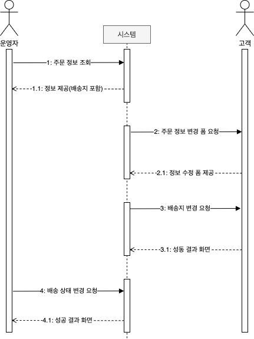

# 8장. 애그리거트 트랜잭션 관리

- 애그리거트의 트랜잭션
- 애그리거트 잠금 기법

## 애그리거트와 트랜잭션

한 애그리거트를 두 사용자가 거의 동시에 변경할 때 트랜잭션이 필요하다.

두 사용자가 하나의 애그리거트를 동시에 변경하고 반영할때 DBMS 가 지원하는 트랜잭션과 함께 애그리거트를 위한 추가적인 트랜잭션 처리 기법이 필요한다.

대표적인 트랜잭션 처리 방식에는 선점(Pessimistic) 잠금과 비선점(Optimistic)잠금이 있다.

## 선점 잠금(Pessimistic Lock)

선점 잠금은 먼저 애그리거트를 구한 스레드가 애그리거트 사용이 끝날 떄까지 다른 스레드가 해당 애그리거트를 수정하는 것을 막는 방식이다.

한 스레드가 애그리거트를 구하고 수정하는 동안 다른 스레드가 수정할 수 없으므로 동시에 애그리거트를 수정할 때 발생하는 데이터 충돌 문제를 해소할 수 있다.

선점 잠금은 보통 DBMS가 제공하는 행 단위 잠금을 사용해서 구현한다.

오라클을 비롯한 다수 DBMS가 for update와 같은 쿼리를 사용해서 특정 레코드에 한 사용자만 접근할 수 있는 잠금 장치를 제공한다.

JPA의 EntityManager는 LockModeType을 인자로 받는 find() 메서드를 제공하는데, LockModeType.PESSIMISTIC_WRITE를 값으로 전달하면 해당 엔티티와 매핑된 테이블을 이용해서 선점 잠금 방식을 적용할 수 있다.

하이버네이트의 경우 잠금 모드로 사용하면 `for update`쿼리를 사용해서 선점 잠금을 구현한다.

## 선점 잠금과 교착 상태

선점 잠금 기능을 사용할 떄는 잠금 순서에 따른 `deadlock`이 발생하지 않도록 주의해야 한다.

이런 문제가 발생하지 않도록 하려면 잠금을 구할 떄 최대 대기 시간을 지정해야 한다.

JPA의 경우 힌트를 사용해서 최대 대기 시간을 지정해 줄 수 있지만, 힌트를 사용할 때 주의할 점은 DBMS에 따라 힌트가 적용되지 않을 수도 있다.

## 비선점 잠금(Optimistic Lock)

위의 과정에서 운영자가 배송지 정보를 조회하고 배송 상태로 변경하는 사이에 고객이 배송지를 변경하는 작업은 선점 잠금 방식으로 해결할 수 없다.

이때 필요한 것이 비선점 잠금이다. 비선점 잠금 방식은 잠금을 해서 동시에 접근하는 것을 막는 대신 변경한 데이터를 실제 DBMS에 반영하는 시점에 변경 가능 여부를 확인하는 방식이다.

또한 비선점 잠금을 구현하기 위해서는 애그리거트에 버전으로 사용할 프로퍼티를 추가하고, 애그리거트를 수정할 때마다 값이 1씩 증가해야한다.

JPA는 버전을 이용한 비선점 잠금 기능을 지원한다. 버전으로 사용할 필드에 `@version` 에노테이션을 붙이고 매핑되는 테이블에 버전을 저장할 칼럼을 추가하면 된다.

응용 서비스는 버전에 대해 알 필요가 없으며 리포지터리에서 필요한 애그리거트를 구하고 알맞은 기능만 실행하면 된다.

비선점 잠금을 위한 쿼리를 실행할 때 쿼리 실행 결과로 수정된 행의 개수가 0이면 이미 누군가 앞서 데이터를 수정한 것이다.

이는 트랜잭션이 충돌한 것이므로 트랜잭션 종료 시점에 `OptimisticLockingFailureException`이 발생한다.

응용 서비스 코드에서 발생시키는 `VersionConflictException`은 `OptimisticLockingFailureException`과 비교하여 개발자 입장에서 트랜잭션 충돌이 발생한 시점이 다른 것을 명확하게 해준다.

`VersionConflictException`은 이미 누군가가 애그리거트를 수정했다는 것을 의미하며 `OptimisticLockingFailureException`은 누군가가 거의 동시에 애그리거트를 수정했다는 것을 의미한다.

## 강제 버전 증가

애그리거트에 애그리거트 루트 외에 다른 엔티티가 존재하는데 기능 실행 도중 루트가 아닌 다른 엔티티의 값만 변경된다고 하자.

그런데 연관된 엔티티의 값이 변경된다고 해도 루트 엔티티 자체의 값은 바뀌는 것이 없으므로 버전 값을 갱신하지 않는다.

따라서 애그리거트 내에 어떤 구성요소의 상태가 바뀌면 루트 애그리거트의 버전 값을 증가해야 비선점 잠금이 올바르게 동작한다.

JPA는 이런 문제를 처리할 수 있도로 EntityManager.find() 메서드로 엔티티를 구할때 강제로 버전 값을 증가시키는 잠금 모드를 지원하고 있다.

## 오프라인 선점 잠금

더 엄격하게 데이터 충돌을 막고 싶다면 누군가 수정화면을 보고 있을 경우 수정 화면 자체를 실행하지 못하도록 해야 한다.

한 트랜잭션 범위에서만 적용되는 선점 잠금 방식이나 나중에 버전 충돌을 확인하는 비선점 잠금 방식으로는 이를 구현할 수 없다.

이때 필요한 것이 오프라인 선점 잠금 방식이다. 오프라인 선점 잠금은 여러 트랜잭션에 걸쳐 동시 변경을 막는다.

잠금을 해제하기 전까지 다른 사용자는 잠금을 구할 수 없다.

오프라인 선점 잠금은 크데 잠금 선점 시도,잠금 확인, 잠금 해제, 락 유효 시간 연장의 네가지 기능을 제공해야 한다.